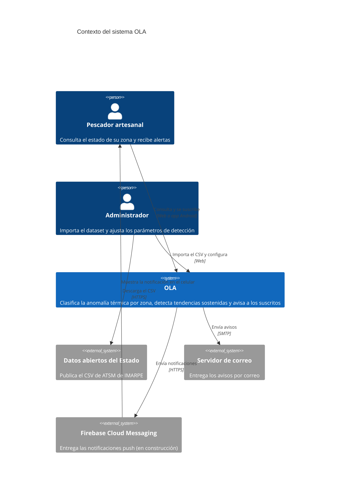
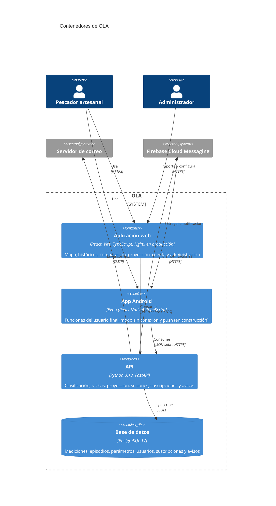

# Modelo del sistema
## Proyecto OLA — Observatorio Litoral de Anomalías térmicas

Diagramas C4 de contexto y de contenedores. Lo marcado como **en construcción** corresponde a
la aplicación móvil (RF-09), que se desarrolla por fases según el plan de calidad
([calidad.md](calidad.md)). Este documento se actualiza al cerrar la fase 4 (notificaciones
push) y la fase 6 (cierre).

---

## 1. Contexto

Quién usa OLA y con qué sistemas externos se comunica.

OLA no descarga el dataset por su cuenta: la importación es manual (RF-08, SRS versión 1.2),
porque IMARPE no garantiza una frecuencia de publicación.

---

## 2. Contenedores

| Contenedor | Responsabilidad | Dónde está |
|---|---|---|
| API | Toda la lógica de negocio. La web y la app no clasifican ni calculan alertas por su cuenta | [backend/](../backend/) |
| Base de datos | Única fuente de verdad. Las migraciones las aplica la API al arrancar | [backend/alembic/](../backend/alembic/) |
| Aplicación web | Interfaz para pescadores y administradores | [frontend/](../frontend/) |
| App Android | Interfaz nativa para el usuario final, con push y datos guardados sin conexión | `mobile/` (desde la fase 1) |

### Código compartido entre la web y la app

La web y la app no se hablan entre sí, pero usan el mismo paquete
[`@ola/compartido`](../packages/compartido/). El paquete tiene:

- los tipos y el cliente de la API;
- la lógica de presentación sin interfaz: orden de las zonas, fechas, paletas validadas, agrupado de series y tramo proyectado;
- los textos en español.

Así, si una ruta de la API o un color de estado cambia, se corrige en un solo lugar. Las
pruebas del contrato con la API también viven ahí. El paquete no depende de React ni del
navegador; guardar el token queda a cargo de cada cliente: localStorage en la web, almacenamiento
cifrado en la app.

---

## 3. Entornos

| Pieza | Desarrollo y pruebas (`compose.yml`) | Producción (`compose.prod.yml`) |
|---|---|---|
| Correo | Mailpit captura los mensajes sin enviarlos | Servidor SMTP real |
| Push | FCM simulado en Docker (desde la fase 4) | Firebase Cloud Messaging |
| Pruebas E2E web | Contenedor de Playwright contra el stack completo | — |
| Pruebas E2E móvil | Maestro en emulador o celular por adb (desde la fase 1) | — |
| Disponibilidad | Uptime Kuma consulta `/api/health/ready` cada minuto | Se añade un monitor si se activa el VPS |
| Entrada | Puertos publicados en el equipo | Traefik de Dokploy, por subdominio y con HTTPS |

La aplicación web se compila con la dirección de la API escrita dentro del JavaScript. La app
Android hace lo mismo: el APK que apunta al Docker local no sirve contra el VPS y hay que
compilarlo de nuevo.
