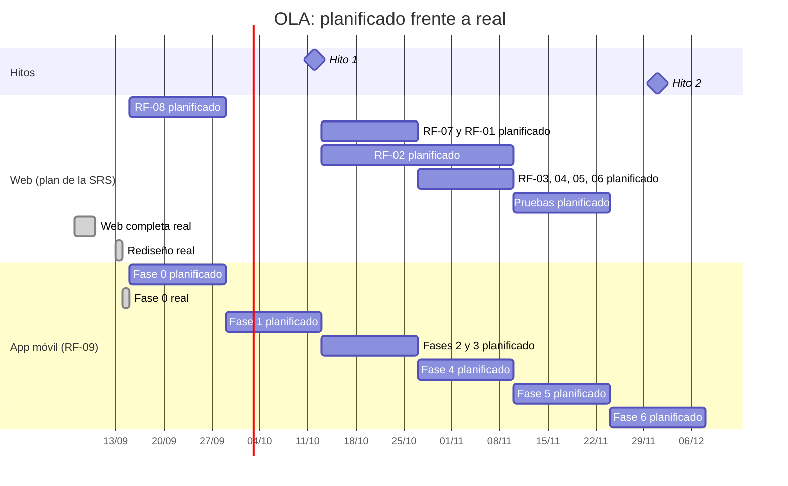

# Plan de aseguramiento de la calidad (SQA)
## Proyecto OLA — Observatorio Litoral de Anomalías térmicas

| Campo | Detalle |
|---|---|
| Curso | Calidad de Software (3.8.2.21) · 2026-II |
| Versión | 1.0 (fase 0 de la aplicación móvil) |
| Fecha | 2026-09-14 |
| Responsable de QA | Jorge Ortiz Castañeda (Scrum Master) |
| Aprobación | Miguel Angel Flores Leon (Product Owner) |

Este plan dice qué calidad se busca en OLA, cómo se comprueba y quién responde por cada
parte. Cubre el backend, la web, el paquete compartido y la aplicación móvil (RF-09). Es un
documento vivo: al cerrar cada fase se añaden sus métricas (sección 7), sus defectos
([defectos.md](defectos.md)), la revisión de riesgos (sección 10) y su retrospectiva
(sección 12).

---

## 1. Objetivos de calidad

Cada objetivo tiene una meta verificable. Donde la SRS fija un valor, se usa como **objetivo**
y este plan añade un **mínimo aceptable**. Una fase que queda entre el mínimo y el objetivo se
puede cerrar, pero su retrospectiva debe proponer una acción de mejora.

| Objetivo | Mínimo | Objetivo | Cómo se comprueba |
|---|---|---|---|
| Clasificar bien cada registro válido del dataset | 100 % | 100 % | Casos límite de RF-01 en pytest (umbral exclusivo, rachas con huecos) |
| Mostrar siempre la fecha del dato | Siempre | Siempre | Pruebas unitarias y E2E de la fecha de referencia en web y app |
| Cobertura de sentencias del backend | 80 % | 90 % | pytest-cov |
| Cobertura del paquete compartido | 80 % | 90 % | Vitest (v8) |
| Cobertura de la web | 70 % | 80 % | Vitest (v8) |
| Cobertura de la app móvil | 70 % | 80 % | Jest (desde la fase 1) |
| Accesibilidad WCAG 2.2 AA | 0 violaciones serias o críticas | 0 | axe en Vitest y Playwright |
| Carga del mapa web (SRS 3.3) | 3 s | 3 s | `e2e/rendimiento.spec.ts` |
| Estado de las zonas en la app (SRS 3.3) | 5 s | 5 s | Maestro y adb (desde la fase 2) |
| Disponibilidad del backend (SRS 3.5) | 90 % | 95 % | Uptime Kuma |
| Defectos críticos abiertos al cerrar una fase | 0 | 0 | [defectos.md](defectos.md) |

---

## 2. Estándares y referencias

| Estándar | Para qué se usa |
|---|---|
| IEEE Std 830-1998 | Estructura de la SRS ([requisitos.md](requisitos.md)) |
| ISO/IEC 25010 (SQuaRE) | Atributos de calidad del producto (SRS, sección 3.5) y clasificación de las métricas |
| WCAG 2.2, nivel AA | Accesibilidad de la web y de la app |
| CMMI 2.0 e ISO/IEC 15504 | Autoevaluación de la madurez del proceso (sección 9) |
| Conventional Commits | Mensajes de commit legibles y agrupables por tipo |

---

## 3. Modelo de proceso: Scrum

### 3.1 Por qué Scrum

| Modelo | Qué habría pasado en OLA |
|---|---|
| Cascada | Exige congelar los requisitos antes de diseñar. En OLA cambiaron cinco RF en la primera semana (SRS 1.2 a 1.6) porque el dataset real tenía huecos, retrasos y decimales con coma. Con cascada, esos cambios habrían llegado tarde y caros |
| Incremental sin marco | Entrega por partes, pero no obliga a revisar ni a mejorar el proceso entre una parte y otra |
| **Scrum** | Sprints de dos semanas que caben en el calendario del curso, una revisión al final de cada uno y una retrospectiva que convierte los errores en cambios concretos |

El equipo tiene cinco personas que llevan otros cursos a la vez. Sprints cortos con un objetivo
claro reducen el riesgo de llegar a un hito sin nada que mostrar (riesgo R-02).

### 3.2 Scrum como ciclo PDCA

Cada sprint, y cada fase de la aplicación móvil, recorre el ciclo de Deming.

| PDCA | En Scrum | En cada fase de la app móvil |
|---|---|---|
| **Plan** | Sprint Planning | Preguntas al PO y maqueta aprobada antes de programar |
| **Do** | Trabajo del sprint | Implementación con sus pruebas |
| **Check** | Sprint Review | Puertas de calidad (sección 5.2), métricas y revisión del PR por el PO |
| **Act** | Retrospectiva | Acciones registradas en la sección 12, que la fase siguiente aplica y verifica |

La mejora continua (Kaizen) está en la última columna: cambios pequeños que se proponen en una
retrospectiva y se comprueban en la siguiente. Una acción que no se comprueba no cuenta como
mejora.

---

## 4. Roles de calidad

| Rol | Persona | Responsabilidad de calidad |
|---|---|---|
| Product Owner | Miguel Angel Flores Leon | Aprueba cada cambio de requisitos (SRS, sección 5). Revisa e integra el Pull Request de cada fase |
| Scrum Master y responsable de QA | Jorge Ortiz Castañeda | Mantiene este plan, verifica las puertas de calidad, conduce la retrospectiva y custodia la bitácora de defectos y la tabla de riesgos |
| Development Team | Frederick Mares Graos, Jhordan Huamani Huamani, Piero Adrian Delgado Chipana | Escriben las pruebas junto con el código y registran los defectos que encuentran. Jhordan responde por RF-09 |
| Docente | Maribel Molina Barriga | Evaluación externa en los hitos |

---

## 5. Actividades de aseguramiento

### 5.1 Revisiones

| Revisión | Cuándo | Evidencia |
|---|---|---|
| Requisitos | Antes de implementar un cambio de RF | Fila en la sección 5 de la SRS con fecha, motivo y responsable (versiones 1.0 a 1.7) |
| Diseño de interfaz | Antes de programar una fase visual | Maqueta aprobada por el PO |
| Código | Al cerrar cada fase | Pull Request en GitHub revisado por el PO, con los resultados reales de las pruebas |
| Regresión visual | Cuando cambia una captura de referencia | Capturas regeneradas en el contenedor de Playwright y revisadas antes de confirmarlas |

### 5.2 Puertas de calidad

Una fase no se cierra ni abre su Pull Request hasta cumplir todo esto. Si una puerta falla por
una excepción justificada, la excepción se registra con su motivo en la retrospectiva.

1. Todas las pruebas de las capas que la fase toca pasan.
2. Verificación de tipos y análisis estático sin errores: mypy, ruff, tsc y ESLint.
3. La cobertura de cada capa está sobre su mínimo (sección 1).
4. axe no reporta violaciones serias ni críticas.
5. No hay defectos críticos abiertos.
6. El diff no incluye secretos: `.env`, credenciales de Firebase ni keystore.
7. La documentación está al día: SRS si cambió un RF, trazabilidad, defectos, riesgos y retrospectiva.

El proyecto no usa integración continua (ver [decisiones.md](decisiones.md), «Lo que quedó
fuera»), así que las puertas se comprueban en local con los comandos de la sección 6.

---

## 6. Estrategia y herramientas de prueba

| Capa | Herramienta | Qué verifica |
|---|---|---|
| Unitaria del dominio | pytest | Rachas, clasificación, proyección, agrupado y lectura del CSV, sin base de datos ni reloj |
| Integración del backend | pytest con PostgreSQL | Endpoints, persistencia y permisos, contra una base separada de la de desarrollo |
| Unitaria compartida | Vitest | Lógica de presentación y contrato de la API que usan la web y la app |
| Unitaria de la web | Vitest, Testing Library y axe-core | Componentes y páginas con dobles del mapa y del gráfico |
| E2E de la web | Playwright y axe | Escritorio y celular emulado (Pixel 7): comportamiento, accesibilidad y capturas |
| Rendimiento de la web | Playwright | Build de producción con 4G simulado |
| Unitaria de la app | Jest y React Native Testing Library | Desde la fase 1 |
| E2E de la app | Maestro | Emulador Android o celular por adb, desde la fase 1 |
| Análisis estático | ruff, mypy (estricto), tsc y ESLint | Estilo, tipos y errores comunes |
| Servicios simulados | Mailpit (correo) y FCM simulado (push, fase 4) | Que un aviso se entrega sin salir a internet |
| Disponibilidad | Uptime Kuma | Chequeo de `/api/health/ready` cada minuto |

```bash
docker compose exec api pytest --cov=ola                                   # backend
docker compose exec api ruff check . && docker compose exec api mypy src   # análisis estático
docker compose exec -w /repo/packages/compartido web pnpm test:cobertura   # paquete compartido
docker compose exec web pnpm test:cobertura                                # web, unitarias
docker compose --profile e2e run --rm e2e                                  # web, E2E
docker compose --profile calidad run --rm calidad reporte.py --horas 168   # disponibilidad
```

### 6.1 Herramientas del sílabo que no se adoptaron por ahora

| Herramienta | Qué aporta | Por qué no se usa todavía | Qué la reemplaza |
|---|---|---|---|
| SonarQube | Análisis estático de varios lenguajes, duplicación, deuda técnica y una puerta de calidad en un solo panel | ruff, mypy y ESLint ya cubren el análisis de cada lenguaje, y la cobertura sale de pytest-cov y Vitest. Añadiría un servicio más sin detectar, hoy, defectos que las otras no detecten | ruff, mypy, tsc, ESLint y las puertas de la sección 5.2. Se puede sumar a `compose.yml` sin tocar el código |
| TestLink | Gestión de planes, suites y casos de prueba con su historial de ejecución | Los casos son automáticos y viven junto al código; su ejecución se repite en cada fase | [trazabilidad.md](trazabilidad.md), que une cada RF con sus pruebas, y los resultados de cada Pull Request |

---

## 7. Métricas de calidad

| Métrica | Atributo ISO/IEC 25010 | Fórmula | Fuente |
|---|---|---|---|
| Cobertura de sentencias | Mantenibilidad (capacidad de ser probado) | Sentencias ejecutadas por las pruebas / sentencias totales × 100 | pytest-cov, Vitest, Jest |
| Densidad de defectos | Fiabilidad (madurez) | Defectos encontrados / miles de líneas de código de producción (KLOC). Se desglosa por fase y por RF | [defectos.md](defectos.md) |
| Tiempo de respuesta | Eficiencia de desempeño | Mediana de 3 cargas en frío hasta ver las 10 zonas | `e2e/rendimiento.spec.ts`; Maestro y adb para la app |
| Disponibilidad | Fiabilidad (disponibilidad) | Chequeos correctos / chequeos con respuesta × 100 | Uptime Kuma |

La disponibilidad solo mide el tiempo en que el entorno estuvo levantado. Con el equipo apagado
no hay chequeos y ese tiempo no cuenta como caída; el informe muestra el periodo cubierto.

### 7.1 Línea base (fase 0, 2026-09-14)

| Métrica | Valor | Nota |
|---|---|---|
| Cobertura del backend | 95 % | 442 pruebas. `startup.py` figura con 0 % porque solo corre al arrancar un contenedor de producción (ver trazabilidad.md) |
| Cobertura del paquete compartido | 97.3 % | 124 pruebas |
| Cobertura de la web | 89.9 % | 241 pruebas unitarias |
| Cobertura de la app móvil | — | Se mide desde la fase 1 |
| Densidad de defectos | 2.39 por KLOC | 21 defectos en 8.8 KLOC (4,286 líneas del backend y 4,517 de la web, sin pruebas; incluye comentarios y líneas en blanco). 1 crítico, ya corregido. 1 medio abierto (D-20) |
| Carga del mapa web | 1.10 s | Mediana medida el 2026-09-14, después de mover la lógica al paquete compartido (antes, 1.07 s). Portada de 169.8 kB comprimidos |
| Estado de las zonas en la app | — | Se mide desde la fase 2 |
| Disponibilidad | 100 % (3 chequeos) | Medición iniciada el 2026-09-14 a las 19:27 (hora de Lima). Todavía no es representativa |

### 7.2 Medición por fase

| Fase | Cierre | Cobertura backend / compartido / web / app | Defectos nuevos (críticos) | Estado en la app | Disponibilidad |
|---|---|---|---|---|---|
| 0 | 2026-09-14 | 95 % / 97.3 % / 89.9 % / — | 2 (0) | — | Inicio de la medición |

---

## 8. Costo de calidad

Los costos se expresan en horas estimadas y en soles, a una tarifa referencial de **S/ 25 por
hora** (desarrollador junior en Lima). Las horas son estimaciones del esfuerzo de cada
actividad, no un registro de tiempo.

| Categoría | Qué se hizo en OLA | Horas | Costo |
|---|---|---|---|
| **Prevención** | Precisar la SRS antes de programar (versiones 1.2 a 1.6): rachas con huecos, fecha de referencia tomada del dato, ambos modelos de proyección | 6 | S/ 150 |
| Prevención | Maquetas aprobadas antes de las cuatro fases del rediseño web | 4 | S/ 100 |
| Prevención | Guía de diseño con la paleta validada a contraste 3:1 | 3 | S/ 75 |
| Prevención | Este plan, la tabla de riesgos y la SRS 1.7 | 6 | S/ 150 |
| **Evaluación** | Pruebas del backend: unitarias e integración | 20 | S/ 500 |
| Evaluación | Pruebas de la web y del paquete compartido: unitarias, E2E, accesibilidad, capturas y rendimiento | 20 | S/ 500 |
| Evaluación | Correr las suites y revisar capturas al cerrar cada fase | 6 | S/ 150 |
| **Falla interna** | 20 defectos corregidos antes de llegar a un usuario ([defectos.md](defectos.md)) | 22.25 | S/ 556.25 |
| **Falla externa** | Ningún defecto llegó a producción | 0 | S/ 0 |

| Resumen | Horas | Costo |
|---|---|---|
| Costo de conformidad (prevención + evaluación) | 65 | S/ 1,625 |
| Costo de no conformidad (fallas) | 22.25 | S/ 556.25 |

**Lectura.** El único defecto crítico (D-01, un decimal con coma que corrompía el valor) se
atrapó en una prueba unitaria y costó una hora. Si hubiera llegado a producción, un pescador
habría visto una zona clasificada con un valor falso. El costo de esa falla externa no se
puede poner en soles con honestidad: además de corregir el importador y reimportar el dataset,
habría que avisar a los usuarios, y la confianza perdida en una herramienta de alertas no se
recupera con un parche. Por eso la falla externa es la categoría más cara aunque hoy valga cero.

El otro dato que importa: 12 de los 21 defectos se encontraron en E2E o en revisión, que son
etapas más caras que la unitaria. Varias retrospectivas apuntan a detectar antes (sección 12).

---

## 9. Madurez del proceso

Autoevaluación del equipo, no certificada. Sirve para saber dónde está el proceso y qué falta
para el siguiente nivel.

### 9.1 CMMI 2.0

| Área de práctica | Evidencia en el repositorio | Valoración |
|---|---|---|
| Desarrollo y gestión de requisitos | SRS IEEE 830 con 8 versiones justificadas; matriz de responsables; trazabilidad RF → pruebas | Implementada |
| Gestión de la configuración | Git con Conventional Commits, un Pull Request por fase, lockfile único, migraciones versionadas, secretos fuera del repositorio | Implementada |
| Verificación y validación | Pruebas en cuatro capas; maquetas aprobadas antes de programar; E2E contra el sistema completo con datos reales | Implementada |
| Análisis y resolución de decisiones | [decisiones.md](decisiones.md) registra cada decisión con su motivo y la alternativa descartada | Implementada |
| Revisiones por pares | El PO revisa el PR de cada fase desde la fase 0 de la app. Antes solo había revisión de capturas | Parcial |
| Aseguramiento de calidad del proceso | Este plan y sus puertas de calidad, vigentes desde la fase 0 de la app | Parcial |
| Gestión del desempeño y medición | Métricas con línea base; todavía sin historia de varias fases | Parcial |
| Planificación y monitoreo | Sprints con hitos, Gantt planificado frente a real, retrospectiva por fase | Parcial |
| Gestión de riesgos | Tabla de riesgos con revisión por fase, creada en la fase 0 de la app | Parcial |
| Estimación | No hay estimación formal del esfuerzo de cada fase | No implementada |
| Gestión de acuerdos con proveedores | No aplica: no hay proveedores contratados; IMARPE es una fuente pública | No aplica |

**Conclusión.** El proceso supera el nivel 1: el trabajo no depende de heroicidades, porque
requisitos, configuración y verificación siguen prácticas repetibles con evidencia. No alcanza
todavía el nivel 2, que pide que las prácticas de gestión (medición, riesgos, estimación,
revisiones) tengan historia. Para llegar hace falta estimar cada fase antes de empezarla,
acumular al menos tres fases de métricas y documentar la revisión de cada PR. Se revisa en la
fase 6.

### 9.2 ISO/IEC 15504 (SPICE)

La norma evalúa la capacidad de cada proceso por separado, de 0 (incompleto) a 5 (en
optimización). Hoy está reemplazada por la serie ISO/IEC 33000, que conserva la escala.

| Proceso | Nivel | Por qué |
|---|---|---|
| Gestión de requisitos | 2 · Gestionado | Los cambios se planifican, se aprueban y quedan registrados |
| Construcción del software | 2 · Gestionado | Convenciones de código, análisis estático y commits pequeños y revisables |
| Pruebas | 2 · Gestionado | Estrategia definida por capa y resultados registrados en cada fase |
| Gestión de la configuración | 2 · Gestionado | Ramas, PRs, lockfile y migraciones bajo control de versiones |
| Aseguramiento de la calidad | 1 · Realizado | Se hacía, pero sin plan hasta esta fase |
| Resolución de problemas | 1 · Realizado | Los defectos se corregían; la bitácora con severidad y costo empieza en la fase 0 |
| Gestión del proyecto | 1 · Realizado | Hay cronograma, pero sin estimación ni control del avance frente a lo planificado |

Ningún proceso llega al nivel 3 (Establecido), que exige un proceso estándar de la organización
aplicado en varios proyectos. Meta para la fase 6: aseguramiento de la calidad y resolución de
problemas en nivel 2.

---

## 10. Gestión de riesgos

Probabilidad: Baja, Media o Alta. Impacto: Bajo, Medio, Alto o Muy alto. La tabla se revisa al
cerrar cada fase.

| ID | Riesgo | P | I | Señal de alerta | Mitigación | Responsable | Estado |
|---|---|---|---|---|---|---|---|
| R-01 | IMARPE cambia el formato del CSV o deja de publicarlo | Media | Alto | Una importación rechaza el archivo entero o la fecha del dato envejece | RF-08 valida la cabecera y rechaza el archivo completo si no coincide. La fecha del dato siempre visible avisa a los usuarios. Revisión manual semanal de la publicación | Miguel Angel Flores Leon | Abierto |
| R-02 | Retraso por un equipo pequeño que lleva otros cursos | Alta | Medio | Una fase no cierra en el sprint planificado (sección 13) | Fases cortas con pausa y alcance priorizado: la administración se queda en la web. El Sprint 7 queda solo para el cierre | Jorge Ortiz Castañeda | Abierto |
| R-03 | Una alerta equivocada hace perder la confianza de los pescadores | Baja | Muy alto | OLA y el boletín de ENFEN discrepan sobre una zona | Pruebas de los límites de RF-01. Los dos modelos de proyección se muestran juntos. La fecha del dato y el aviso «no reemplaza los boletines de IMARPE» siempre visibles | Jhordan Huamani Huamani | Abierto |
| R-04 | La notificación push no llega (FCM o el ahorro de batería del fabricante la retienen) | Media | Alto | Avisos push en estado fallido, o la prueba en celular no muestra la notificación | Correo y aviso en la app como canales redundantes (RF-03). Cada fallo queda registrado y se reintenta. Verificación en un celular real en la fase 4 | Jhordan Huamani Huamani | Abierto |
| R-05 | Secretos subidos al repositorio (`.env`, credenciales de Firebase, keystore) | Baja | Alto | Uno de esos archivos aparece en `git status` o en el diff de un PR | `.gitignore` y puerta de calidad 6 antes de cada push. Si se filtra uno, se revoca y se genera otro | Jorge Ortiz Castañeda | Abierto |

**Revisiones**

| Fase | Fecha | Cambios |
|---|---|---|
| 0 | 2026-09-14 | Tabla creada. Ningún riesgo materializado |

---

## 11. Gestión de cambios y de la configuración

### 11.1 Cambios en los requisitos

1. Alguien del equipo propone el cambio y explica qué RF toca.
2. Se evalúa el impacto: pruebas que cambian, fases afectadas, riesgos.
3. El PO lo aprueba o lo rechaza.
4. Si se aprueba, la fila de la sección 5 de la SRS se escribe **en el mismo avance** que
   implementa el cambio, y se actualiza la trazabilidad.

La SRS lleva 8 versiones con este flujo (1.0 a 1.7).

### 11.2 Configuración

| Elemento | Cómo se controla |
|---|---|
| Código, documentación, migraciones y capturas de referencia | Git. `main` siempre integrado; una rama `app-movil/fase-N` y un Pull Request por fase |
| Dependencias JavaScript | Un solo `pnpm-lock.yaml` para la web, el paquete compartido y la app; las instalaciones usan `--frozen-lockfile` |
| Dependencias Python | `pyproject.toml` del backend |
| Entornos | `compose.yml` (desarrollo y pruebas) y `compose.prod.yml` (producción) |
| Versión del APK | Número de versión en la configuración de la app, desde la fase 1 |
| Fuera del control de versiones | `.env`, credenciales de Firebase y keystore de firma. Solo se versiona la plantilla `.env.example` |

---

## 12. Retrospectivas

Cada fase responde cuatro preguntas: qué funcionó, qué falló, qué se cambia en la siguiente y
si funcionó lo que se cambió la vez anterior.

### Rediseño de la web (2026-09-13)

- **Funcionó:** las maquetas aprobadas antes de programar evitaron rehacer pantallas.
- **Falló:** dos verificaciones pasaban sin verificar nada: el servidor de Vite desactualizado
  (D-10) y la tolerancia visual relativa (D-17).
- **Acción:** tolerancia visual absoluta de 20 píxeles y sondeo de archivos en Docker. Al ver una
  prueba en verde tras un cambio grande, confirmar que falla cuando debe.

### Fase 0 de la app móvil (2026-09-14)

- **Funcionó:** mover la lógica de la web al paquete compartido no cambió su comportamiento. Las
  241 pruebas de la web y las 91 que se movieron siguieron en verde, y se añadieron 33 pruebas
  del contrato con la API.
- **Falló:** una prueba de App tardó más de 10 s y falló al medir la cobertura mientras pytest
  corría a la vez; sola, pasó. Editar `.env` durante una corrida reinició la API y cortó
  pytest. Docker Hub no respondió durante unos minutos. Y la puerta 1 no se cumplió del todo:
  una prueba del backend falla en local por depender del `.env` (D-20). Se registró como
  excepción porque el código probado está bien; la prueba es la que no es hermética. Por
  último, el informe HTML de cobertura quedó dentro de la carpeta que vigila Vite y trabó las
  E2E (D-21); se excluyó y la suite volvió a pasar: 167 casos, 0 fallos.
- **Acción para la fase 1:** al cerrar una fase, correr las suites pesadas una por una y no
  tocar `.env` mientras corren. Si esa prueba de App vuelve a fallar sin carga, se registra como
  defecto. Todo lo que genere archivos (cobertura, compilaciones de la app) se excluye de los
  vigilantes y de Git antes de la primera corrida.
- **¿Funcionó la acción anterior?** Sí: la tolerancia absoluta no dejó pasar ningún cambio
  visual en esta fase.

---

## 13. Cronograma

Sprints de dos semanas. Hito 1: semana del 12 al 17 de octubre. Hito 2: primera semana de
diciembre. Cada fase tiene dos barras: la planificada y la real, que se completa al cerrarla.



| Fase de la app | Sprint planificado | Responsable | Verifica | Aprueba |
|---|---|---|---|---|
| 0 · Proceso de calidad, SRS 1.7 y paquete compartido | 2 (15–28 sep) | Jhordan Huamani Huamani | Jorge Ortiz Castañeda | Miguel Angel Flores Leon |
| 1 · Entorno Android y base de la app | 3 (29 sep–12 oct) | Jhordan Huamani Huamani | Jorge Ortiz Castañeda | Miguel Angel Flores Leon |
| 2 · Estado, mapa y sin conexión | 4 (13–26 oct) | Jhordan Huamani Huamani | Jorge Ortiz Castañeda | Miguel Angel Flores Leon |
| 3 · Cuenta y zonas de interés | 4 (13–26 oct) | Jhordan Huamani Huamani | Jorge Ortiz Castañeda | Miguel Angel Flores Leon |
| 4 · Notificaciones push | 5 (27 oct–09 nov) | Jhordan Huamani Huamani | Jorge Ortiz Castañeda | Miguel Angel Flores Leon |
| 5 · Histórico, comparación y proyección | 6 (10–23 nov) | Jhordan Huamani Huamani | Jorge Ortiz Castañeda | Miguel Angel Flores Leon |
| 6 · Cierre | 7 (24 nov–07 dic) | Jhordan Huamani Huamani | Jorge Ortiz Castañeda | Miguel Angel Flores Leon |

La web se terminó mucho antes de lo que planificaba la SRS: todos sus RF quedaron integrados el
10 de septiembre, en el Sprint 1. La desviación a favor liberó los sprints que la app ocupa ahora.
